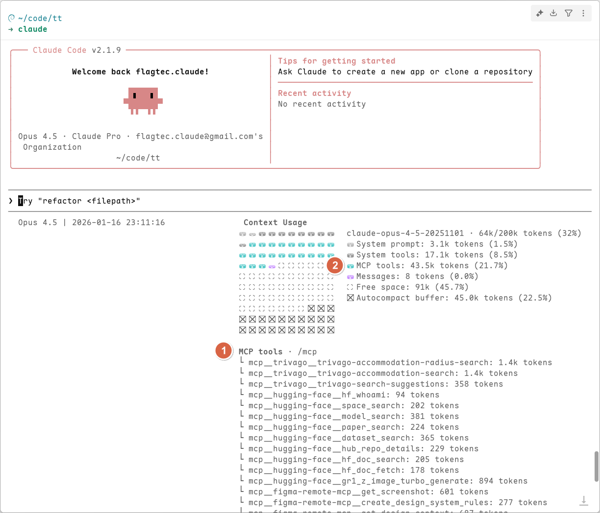
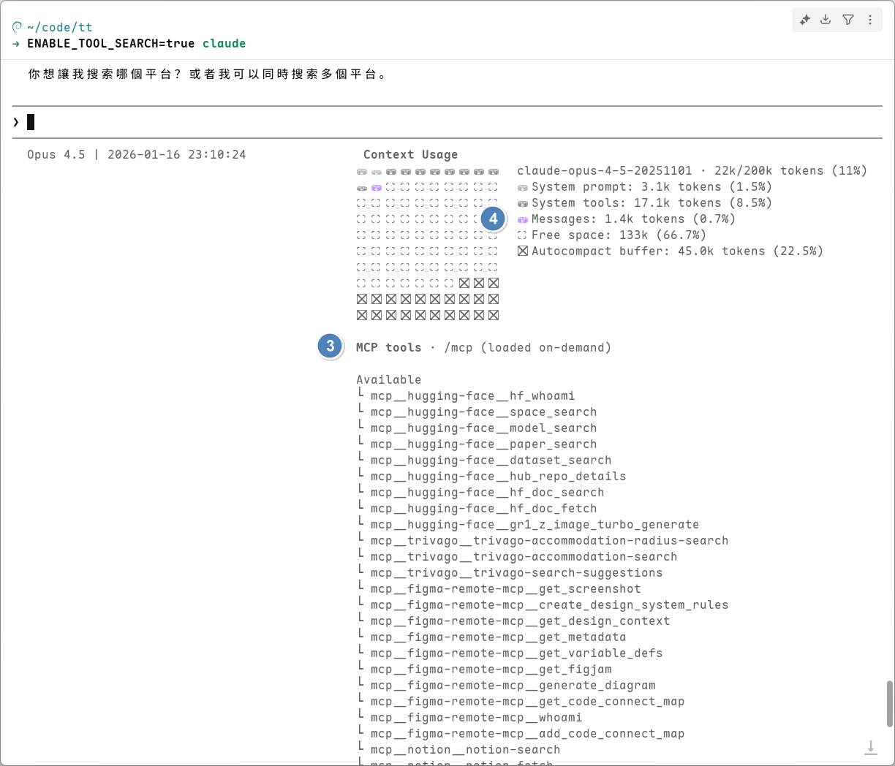

## 本書出版後的更新/修正

由於 Claude Code 改版速度很快，以下列出新版本與本書撰寫時差異的更新內容。

## 鍵盤快捷鍵

- 本書撰寫時，Windows 平台使用 <kbd>Alt</kbd>+<kbd>M</kbd> 切換一般模式、Auto-Accept Mode 以及 Plan Mode，但是從 2.0.31 版本後，所有平台都統一使用 <kbd>Shift</kbd>+<kbd>Tab</kbd> 切換，原本的快捷鍵已失效。

## MCPSearch 工具

Claude Code 2.1.7 版預設啟用  [MCPSearch 工具](https://github.com/anthropics/claude-code/blob/main/CHANGELOG.md#217)，不過我們測試時遇到不會自動啟用的狀況，參考了 Claude Code Github 的 [issue](https://github.com/anthropics/claude-code/issues/18370) 找到繞路的方法，只要設定環境變數 ENABLE_TOOL_SEARCH 為 true，就可以了：

- Windows 的 PowerShell 可以這樣執行 Claude Code：

  ```powershell
  $env:ENABLE_TOOL_SEARCH="true"; claude
  ```

- macOS/Linux 下可以這樣執行 Claude Code：

  ```bash
  export ENABLE_TOOL_SEARCH=true; claude
  ```

或者也可以直接在系統層級設定環境變數。

啟用 MCPSearch 工具最大的好處就是每次與模型交談時，不會直接把所有 MCP 工具的完整描述都送給模型，而是由 MCPSearch 作為中介，先挑出可能需要的 MCP 工具，真的判斷要用到某個 MCP 工具時，才把這個工具的完整描述送給模型。

像是以下這個例子，在①安裝了好幾個 MCP 工具後，會看到這些 MCP 工具耗用了 ②43.5K 的 token：



啟用 MCPSearch 工具後，你可以看到③安裝的 MCP 工具都還在，但是④完全看不到 MCP 耗用任何 token 數:



MCPSearch 工具就是希望讓 MCP 工具的使用可以像是 Skill 那樣，先讓模型確認會需要用到才把完整的資訊提供給模型，以剛剛的例子來說，如果多輪問答時都沒需要用到安裝的 MCP 工具，就可以省掉每次 43.5K 的 token，整個 context windows 也才 200K，有沒有 MCPSearch 工具差很多啊！
